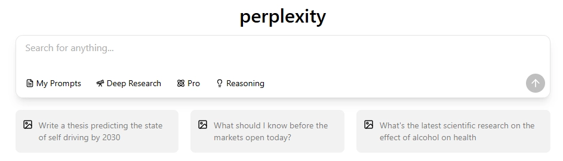
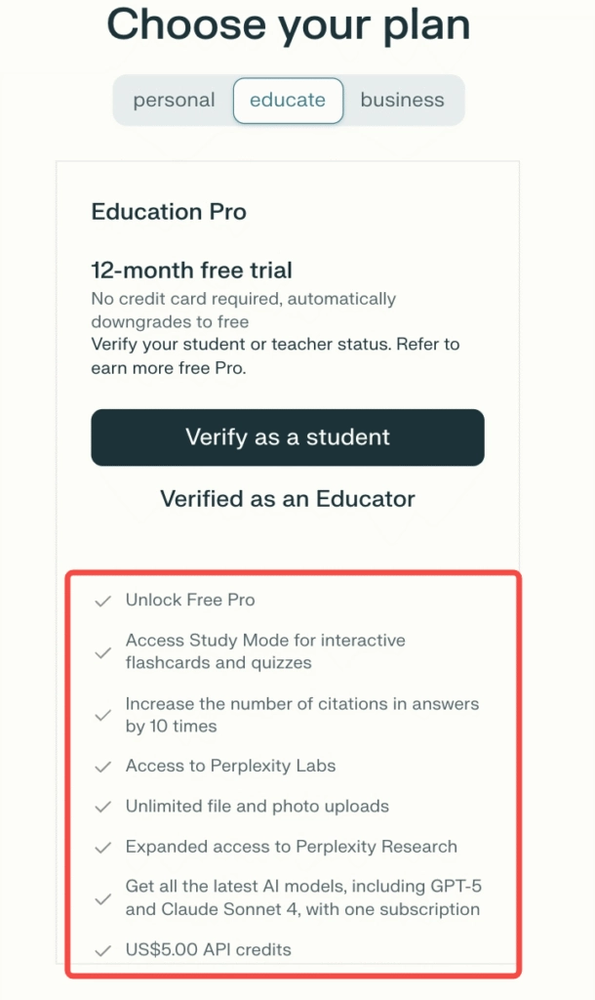
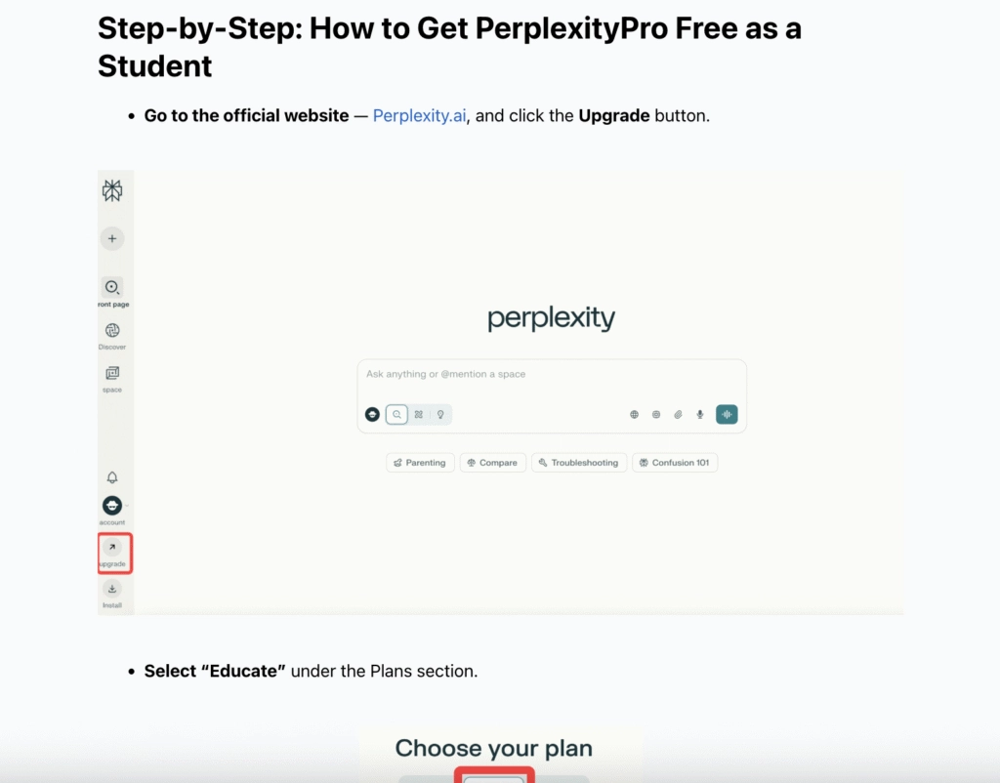
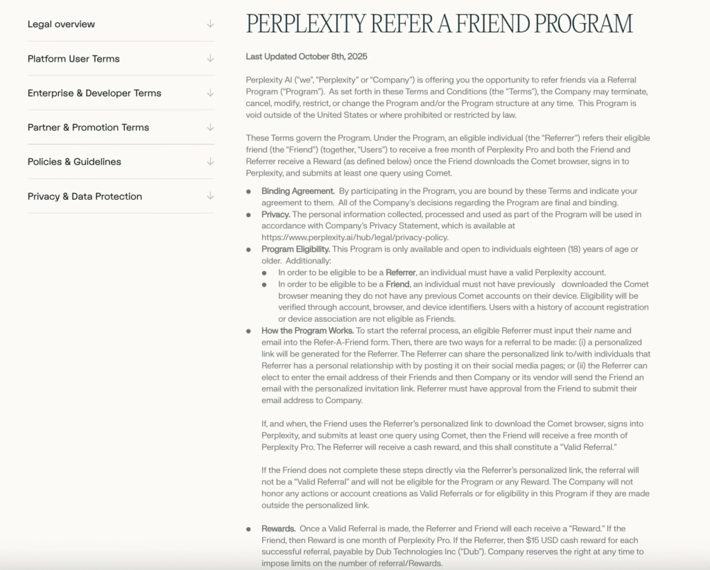

# 学生如何免费用上Perplexity Pro？2025最新教程

---

2025年，AI搜索工具已经成了学生党的刚需——写论文要查资料，做作业要找答案，准备考试要整理知识点。但问题来了：好用的AI工具都要钱，学生预算有限怎么办？

好消息是，**Perplexity官方推出了教育计划**，学生和教师可以**免费使用Pro版整整12个月**。不需要绑卡，不用担心自动扣费，验证通过后直接升级到完整版Pro账号。这意味着你能用上Study Mode、无限上传文件、甚至GPT-5和Claude Sonnet 4——全都免费。

如果你想同时用Perplexity、ChatGPT、Gemini等多个顶级AI模型，又不想分别订阅，[**Global GPT**](https://pplx.ai/ixkwood69619635)提供了一个更划算的一站式方案。

[**立即试用Perplexity >**](https://pplx.ai/ixkwood69619635)

---

## Perplexity教育计划是什么？

简单说，这是Perplexity专门给学生和教师准备的福利：**验证身份后，免费用Pro版一年**。

普通用户订阅Pro要每月20美元，但教育版完全免费，到期后自动降级到免费版（不会偷偷扣钱）。这个计划的初衷是让学生和老师能无门槛地用AI做研究、学习和提升效率。

**核心权益包括：**

- 完整的Perplexity Pro功能
- **12个月免费使用**，无需绑定信用卡
- 到期后自动转为免费版，不会产生费用
- 解锁Perplexity Labs、Research Mode和Study Mode
- 赠送**5美元API额度**

---

## 哪些人可以申请学生优惠？

Perplexity的免费学生计划面向以下人群开放：

- **大学或学院在读学生**（需要有效的学校邮箱，如.edu、.ac等后缀）
- **高中生**（可通过学生证验证）
- **教师、讲师或教授**
- **学术研究人员**（需隶属于教育机构）

*小提示：*如果你的学校邮箱没被系统识别，可以通过Perplexity的支持表单提交人工审核申请。

---

## 如何免费获取Perplexity Pro？（详细步骤）

我们整理了一份完整的申请指南——[**点击这里查看详细教程**](https://pplx.ai/ixkwood69619635)。

**教育版Pro能做什么？**

教育计划解锁的功能和付费Pro版完全一样，甚至还多了一些学术专属工具。

### 主要功能

- **Study Mode** – 自动生成互动式学习卡片、摘要和测验题
- **扩展引用** – 答案中的引用来源数量提升10倍，适合深度研究
- **无限上传** – 上传文件、文档和图片，让AI基于你的资料回答问题
- **Perplexity Labs访问权** – 试用实验性AI工具和测试版功能
- **Research Mode** – 进行深度学术或技术分析，附带完整引用
- **多模型AI接入** – 在一个订阅内使用**GPT-5**、**Claude Sonnet 4**等顶级模型

这些功能让[Perplexity](https://pplx.ai/ixkwood69619635)成为**最适合学生的AI助手之一**，无论是写论文、备考还是日常学习都能派上用场。

---

## 遇到验证或访问问题怎么办？

如果你在激活学生账号时遇到麻烦，可以试试这些方法：

- 确认你的**邮箱域名是学术类**（.edu、.ac、.school等）
- 尝试用**电脑浏览器**而不是手机注册
- 联系**Perplexity客服**，附上你的**学生证或在读证明照片**

通常24到48小时内就能收到审核结果。

---

## 如何延长或续订免费Pro权限？

想在免费期结束后继续用Pro版？这里有几个合法途径：

1. **推荐同学或朋友** – 通过推荐计划赚取现金奖励，用来兑换Pro版

2. **明年重新申请** – 如果你还在读，可以再次提交验证
3. **升级到[Global GPT](https://pplx.ai/ixkwood69619635)** – 长期使用Perplexity、ChatGPT、Gemini等多个AI工具，一个订阅全搞定，价格更实惠

---

## 结语

对学生来说，Perplexity教育计划是个实打实的福利——**12个月免费Pro版，不绑卡不扣费，功能完整**。无论你是要写论文、准备考试还是日常学习，这个工具都能帮你省下大量时间和精力。

如果你想同时用上多个顶级AI模型，又不想分别付费，[**Global GPT**](https://pplx.ai/ixkwood69619635)提供了一个更经济的解决方案——一个账号搞定Perplexity、ChatGPT、Gemini等工具，特别适合需要长期使用AI的学生和研究者。
